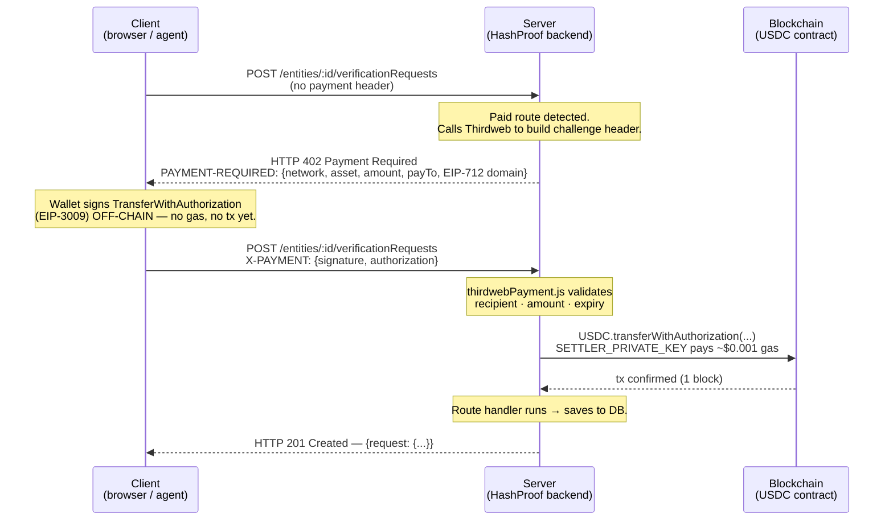

# x402 Payment Flow in HashProof

## What is x402?

x402 is an HTTP payment protocol. Instead of creating a billing account or API key, a client **pays per request** by attaching a signed payment authorization to the HTTP call.

From the client's perspective:
1. Call the endpoint → get a `402 Payment Required` response
2. Sign an authorization (off-chain, no gas) → resend with the signature
3. Get a `200 OK` with the data

---

## Full flow, step by step



---

## Who pays what

| Party | What they pay | How |
|-------|--------------|-----|
| **Client** (user / agent) | $0.10 USDC | Signs off-chain — no gas, no blockchain transaction |
| **Backend** (`SETTLER_PRIVATE_KEY`) | ~$0.001 ETH in gas | Calls `transferWithAuthorization` on-chain |

The client is completely gasless. The backend pays a negligible amount of gas to collect the payment.

---

## Role of each component

| Component | What it does |
|-----------|--------------|
| `utils/chains.js` | Single source of truth for network config (USDC addresses, RPC URLs, chain objects) |
| `thirdwebPayment.js` | Middleware: generates 402 challenge when no payment; validates and settles when payment is present |
| `settleEOA.js` | Decodes the signed authorization, validates it, calls `transferWithAuthorization` via our EOA |
| Thirdweb SDK (`thirdweb/x402`) | Formats the `PAYMENT-REQUIRED` challenge header. Does NOT execute any transaction |
| `useFetchWithPayment` (React hook) | Reads the 402 challenge, connects the wallet, signs the authorization, resends the request |
| `SETTLER_PRIVATE_KEY` | Plain EOA wallet that submits the on-chain transaction. Must hold gas tokens on each active network |
| `PAY_TO` | Address that receives the USDC payment |

---

## Why we don't use Thirdweb's bundler/paymaster

Thirdweb's facilitator uses Account Abstraction (ERC-4337) to submit transactions, which requires billing on mainnet. `settleEOA.js` submits directly with a plain EOA — same result, no billing required.

---

## Supported networks

Configured via `X402_NETWORKS` in `backend/.env` (and `VITE_X402_NETWORKS` in `frontend/.env`).  
**Both must match.** To change network, update both env vars — no code changes needed.

| Key | Network | Gas token |
|-----|---------|-----------|
| `base` | Base mainnet (eip155:8453) | ETH |
| `celo` | Celo mainnet (eip155:42220) | CELO |
| `polygon` | Polygon mainnet (eip155:137) | MATIC |
| `arbitrum` | Arbitrum One (eip155:42161) | ETH |

USDC addresses and RPC URLs for each network are in `backend/src/utils/chains.js` and `frontend/src/chains.js`.

---

## Paid endpoints

| Endpoint | Price | Description |
|----------|-------|-------------|
| `POST /issueCredential` | $0.10 USDC | Issue one verifiable credential |
| `POST /entities/:id/verificationRequests` | $49 USDC | Submit an entity verification request |

Prices are defined in `backend/src/utils/constants.js`.

---

## For an AI agent calling the API

An agent can call paid endpoints without any UI. Example using the Thirdweb Node.js SDK:

```js
import { createThirdwebClient } from "thirdweb";
import { base } from "thirdweb/chains";
import { wrapFetchWithPayment } from "thirdweb/x402";
import { privateKeyToAccount } from "thirdweb/wallets";

const client = createThirdwebClient({ secretKey: THIRDWEB_SECRET_KEY });
const account = privateKeyToAccount({ client, privateKey: AGENT_PRIVATE_KEY });

let currentChain = base;
const wallet = {
  getAccount: () => account,
  getChain: () => currentChain,
  switchChain: async (chain) => { currentChain = chain; },
};

const fetchWithPayment = wrapFetchWithPayment(fetch, client, wallet);

const res = await fetchWithPayment("https://api.hashproof.dev/issueCredential", {
  method: "POST",
  headers: { "Content-Type": "application/json" },
  body: JSON.stringify(payload),
});
```

The agent needs a wallet with USDC on Base (or whichever network is configured). It pays $0.10 USDC per credential — no gas, no API keys, no subscriptions.
